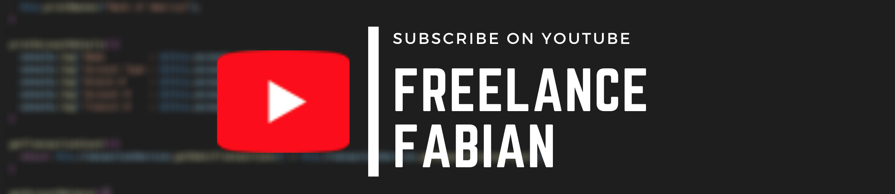

### Simple File Download using JavaScript and Html

[YouTube : Freelance Fabian](https://www.youtube.com/channel/UC2i2kz987XlV9GzO_OdPTMw)

This mini example covers creating a download link in your browser.

The download links are implement in two different ways :
- The Noob way in noob.js
- The advanced way in advanced.js.

Both scripts are called on page load in index.html. Three buttons are created programmactically, one by the noob.js and two by the  advance.js script. 

The differences between the two implementations are that the advanced way is more robust, its also adds encapsulation, easy configuration, and makes it easy to reuse the code without having to duplicate code.

If you wish to watch video detailing the code and its implementation, you can watch it on my YouTube channel here : 

https://www.youtube.com/watch?v=8yZlcBOOorA
